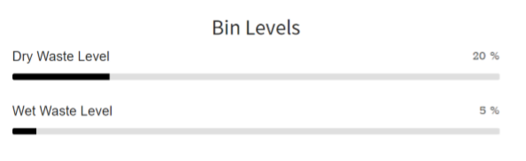

# **IOT based Garbage Monitoring System and Domestic Care**

In this project, a model is being made to overcome the problems of garbage monitoring, management and segregation. The system uses ultrasonic sensors (HC-SR04), a servo motor, moisture sensor, an IR sensor and LED which are connected to NodeMCU ESP-12E. Data from each measuring system and segregater is sent to MySQL database. The data is stored in form of a table which is later retrived and displayed in a [webpage](https://iotgarbagemonitoringsystem.000webhostapp.com/).

## Abstract

In the present scenario, as the population is increasing day by day, the environment should be clean and hygienic. Overloaded garbage bins creates unhygienic conditions for people as well as ugliness to that place leaving bad smell. To avoid all such situations, we are going to implement a project called IoT Based Smart Garbage Monitoring system and Domestic Care. This project introduces the design and implementation of garbage monitoring by measuring the garbage level in real time and to alert the municipality whenever the bin is full. The proposed system consists of ultrasonic sensors which measure the garbage level and a microcontroller which controls system operation. It also contains a moisture sensor, which is used to separate waste by using servo motor. For domestic care purpose, we separate or more precisely segregate the waste into two types wet and dry waste, based on the moisture content present in the waste. Segregating the waste and collection level helps in reducing the operational cost at the disposal and reusing time. The system shows the status of garbage bin levels in a website from the sensor data and also sends a notification to mobile whenever a bin is full, so that the waste can be collected. This bin data is also saved to a database for further analysis.
 
## Tools used

- NodeMCU ESP32
- Ultrasonic Sensors (HS 04)
- Servo Motor (SG 90)
- IR sensor
- Moisture Sensor
- 000webhost.com with phpMyAdmin
- Arduino IDE
- Blynk Application
- SQL & PHP

## Circuit diagram

## Result

## Conclusion

The waste segregator, segregates the waste into two major classes: dry and wet. The proposed system would be able to monitor the solid waste collection process and management of the overall collection process. The inlet section is provided with open and close mechanism to regulate the flow of waste. This implementation can efficiently deal the problem of waste disposal which has been proved to be great threat to any developing country. This implementation can efficiently deal the problem of waste disposal which has been proved to be great threat to any developing country. The data that is being collected helps to compute the amount of waste and how it is decomposed. The wet waste collected can also be used as a fertilizer in future. At industrial level methods used for segregation of waste are hazardous to human health and also the process involves manual effort and also complete segregation is not obtained. By segregating waste at root source, not only can waste be recycled but beauty of the surroundings can be maintained.

## References

1. Raghumani Singh, C. Dey, M. Solid waste management of Thoubal Municipality, Manipur- a case  study Green Technology and Environmental Conservation (GTEC 2011), 2011 International  Conference Chennai 21 –24.
2. Smart Garbage Monitoring System Using Node MCU, Mamatha Dhananjaya, Priyanka.K.E,  Nidhi.R, Pooja.K, Grenze ID: 02.ICSIPCA.2017.1.38.  
3. Bajaj JS. Urban Solid Waste Management in India. New Delhi: Planning Commission Government of India; 1995.
4. https://arduino-esp8266.readthedocs.io/en/latest/reference.html
5. https://www.000webhost.com/forum/t/getting-started/16043

***

> **For implenting this project**
>
> * Add database credentials in [dbconfig.php](api/in/dbconfig.php)
> * Add token, ssid, password and host to [NodeMCU code](NodeMCU_code/NodeMCU_code.ino)
> * Update host address in [script.js](script.js)

### Credits

ArunKumar N
